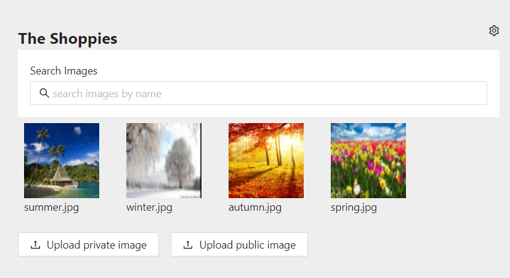

# Shoppies Image Repository
The project was bootstrapped with [Create React App](https://github.com/facebook/create-react-app). <br><br>

It is a simple test workbench for the backend project [Shoppies Image Repository](https://github.com/zm2he/imgrepo), allows you get image list, search images by name, download images, delete images, upload images...all from the web<br>

<br><br><br><br>

# Run the app
To run the app locally<br>
```npm start```

To run the app remotely, first buid it<br>
```npm run build```<br>
Then upload the entire folder /build to a server

# References
[1] [Create React App](https://github.com/facebook/create-react-app)<br>
[2] [Shoppies' Image Repository](http://github.com/zm2he/imgrepo)<br>